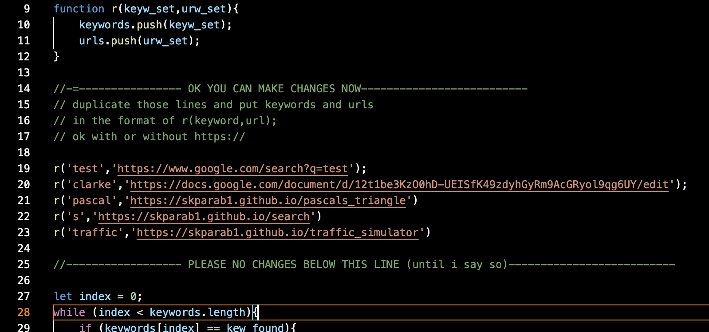

# go
a super fast url shortener in HTML and Js. Basically a sclaed down verion of [my old one](github.com/skparab1/js-url-shortener)

## Much faster than old p5js one

.gif)

- left bottom is old one, top right is new one

## Usage
- edit redirector.js file
- change urls and redirects

