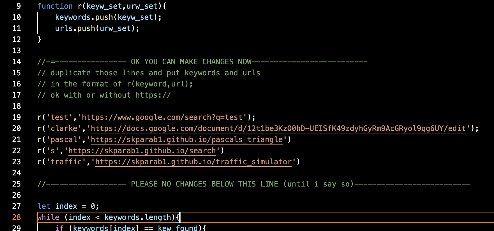

# go
A super fast url shortener in HTML and Js. Basically a scaled down version of [my old one](github.com/skparab1/js-url-shortener)

## Much faster than old p5js one

.gif)

- left bottom is old one, top right is new one

## Main features
- Rapid redirecting (probably comparable to tinyurl.com and bit.ly)
- Average redirect time of <0.7 sec
- Auto https:// adding (will work with or without https:// at beginning or redirect url)
- Sourceing from json file
- In future, adding redirects using a ui, github API, and github actions, like [this](https://github.com/skparab1/server)

.gif)

## Usage
- edit redirects.json file
- change urls and redirects

## Comparison to [my old one](github.com/skparab1/js-url-shortener)
- Pros
  - Much faster because doesnt have to load p5js
- Cons
  - Doesn't have
  - Uses json instead of csv (harder to edit)
  - No password redirect protection
